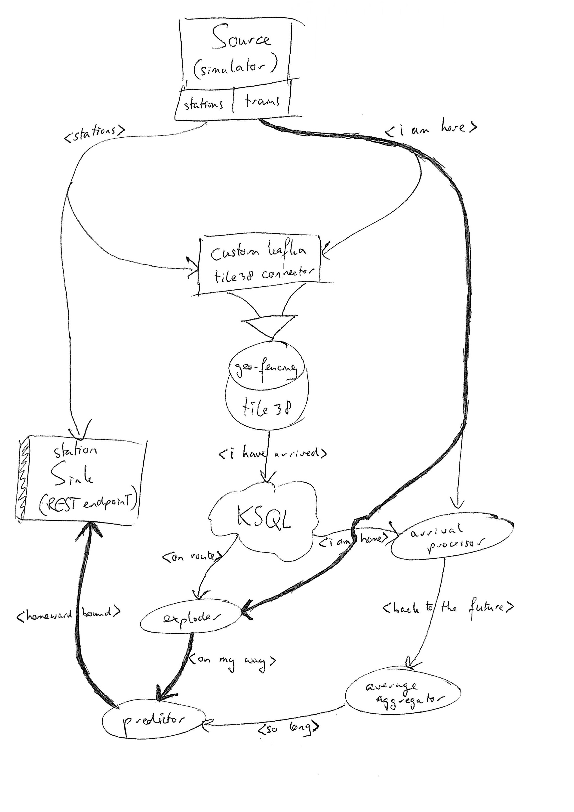

# Train of Thought
*Named after the brilliant lumosity game.*

> Stay away from negative people - They have a problem for every solution.

In this line of reasoning we have recognized a problem. Technology ought to solve problems. If it does without creating another, bigger one it has deserved the right to exist. Have you ever seen people running for the train, in uncomfortable shoes, working clothes or unsuitable bodies, to then arrive exhausted at the station to find out that the train arrives a bit later today. I see it all the time, and actually, I am one of them. Someone should take care of this, right? It is a daily little dose of human suffering faced by contemporary man on a global scale. Many small struggles add up to constitute a large one. Why can we not sync our own movement (changing geo-location) with public transportation movement (also changing geo-location)? Well, in fact we can, and this repo solves the first half of the puzzle. Requirement is the amendement of equal rights; we do so without complicated system interfacing in order to create an utmost generic system that can run/be implemented in any place at any time (it also works for buses). 

It also is a simple programming experiment with as underlying purpose to show (to anyone who'd like to see) how we can transform and manipulate data (streams) into useful and thus valuable information. For this reason, and to allow it to coordinate any transportation monitoring system without complex interfacing, only a minimum (too little really) of input data is required for it to function: train and stations; even the train routs are deduced! Its architecture is highly scalable, and with the right ops-people it could monitor the entire public transportation system of any country.  

The unconventional and unprofessional (kafka topic, mvn module, and class) names are chosen to facilitate communicating the app's inner workings to my wife :) 

## Inner Workings

A picture says more than...

The basic idea is explained with the thick arrowed flow. Each train regularly sends out a message with it's location ([source](source/README.md)). When we split such a message to create a similar one for each station on its route ([exploder](exploder/README.md)) we are ready to add arrival time predictions ([predictor](predictor/README.md)). Without predictions for negative arrival times of passed stations, we end up with each train telling in how much time it will presumably arrive at what station ([station-sink](station-sink/README.md)).   

Question: how do we know the arrival time from a location to a station? Answer: by experience. [Tile38](https://github.com/LeonardoBonacci/kafka-connect-tile38-sink/blob/master/README.md) does the hard work and 'detects' each time some train comes within the range of some station. Knowing this, and with the help of some [KSQL](ksql/README.md) glue, we combine a train-event with an arrival message at the station in the [arrival-processor](arrival-processor/README.md) service. [Kafka-streams windowed joins](https://kafka.apache.org/20/documentation/streams/developer-guide/dsl-api.html#kstream-kstream-join) do an excellent job here. The time difference is how long it actually took the train to arrive from its location to a station. 

Last step is to make predictions. For demo purposes we simply take the average ariving time from a location to a station ([averager](averager/README.md)). It should not be hard to come up with something more intelligent here. We do need to do a bit of work though. There will be way too many lat-lon combinations to make the average value a valuable one. Therefore, let us normalize the location with a [GeoHash](https://en.wikipedia.org/wiki/Geohash) so that approximations becomes useable. 

Voilà, we have a working and streaming processor topology!!

	
## Custom Kafka Connector
Use these configuration ....
* Go to localhost:3030 - Connectors etc., check  logs and topics
* Sometimes it's necessary to restart 'source' after you've first setup the connectors. This in order to read the stations topic from the beginning.
* docker-compose stop source ; docker-compose start source
	
## Run Me
* docker run --net=host -it tile38/tile38 tile38-cli
* SETHOOK trains_at_stations kafka://host.docker.internal:9092/I_HAVE_ARRIVED NEARBY trains FENCE ROAM stations * 50

* docker-compose exec ksql-cli ksql http://ksql-server:8088
* SET 'auto.offset.reset'='earliest';
* SET 'ksql.sink.partitions'='1';
* PRINT i_have_arrived FROM BEGINNING;

CREATE STREAM i_have_arrived_src (id STRING,
							time STRING,
							fields STRUCT<route INT>,
			                 		nearby STRUCT<
				                    	  	key STRING,
				                      	  	id STRING,
				                      	  	object STRING,
				                      		meters INT>)
        WITH (KAFKA_TOPIC='I_HAVE_ARRIVED', VALUE_FORMAT='JSON');

CREATE STREAM i_am_home AS 	SELECT id, time as moment, mystringtoint(nearby->id) as station 
						 	FROM i_have_arrived_src 
						 	WHERE nearby IS NOT NULL 
						 	PARTITION BY id;

CREATE STREAM on_route AS SELECT fields->route AS route, mystringtoint(nearby->id) AS station 
							FROM i_have_arrived_src 
						 	WHERE nearby IS NOT NULL
						 	PARTITION BY route;

* If all services are running and your laptop can handle a bit more, launch two sink container to check out the load balancing
* docker-compose stop sink
* docker-compose up -d --scale sink=3 
* Now query the REST endpoint, first to find the machine name, then to query the data:
* docker run --tty --rm -i --network ks debezium/tooling:1.0
* http sink:8080/train-stations/meta-data
* http --follow 96b52c724a8d:8080/train-stations/data/1
* or, forget about the scaling and just run http sink:8080/train-stations/data/1

## TODO
* simplify setup by adding docker-compose instructions 
* use KTable instead of GlobalKTable in 'station-sink' and 'predictor' services
* make train simulator of wellington
* tune partitions
* compile services to executables and 'sync' with partitions
* tests

## Useful Resoures
* https://lordofthejars.github.io/quarkus-cheat-sheet/
* https://www.udemy.com/course/java-application-performance-and-memory-management/
* https://www.udemy.com/course/a-comprehensive-introduction-to-java-virtual-machine-jvm/
* https://www.udemy.com/course/jvm-security-the-java-sandbox-model/
* https://medium.com/@coderunner/debugging-with-kafkacat-df7851d21968
* https://medium.com/test-kafka-based-applications/https-medium-com-testing-kafka-based-applications-85d8951cec43
* https://www.testcontainers.org/
* https://sookocheff.com/post/kafka/kafka-in-a-nutshell/
* https://blog.newrelic.com/engineering/apache-kafka-event-processing/ 
* https://blog.newrelic.com/engineering/effective-strategies-kafka-topic-partitioning/
* https://docs.confluent.io/current/app-development/kafkacat-usage.html
* https://berlinbuzzwords.de/sites/berlinbuzzwords.de/files/media/documents/geo-analytics-with-kafka-v1.0.pdf
* https://www.confluent.io/blog/build-udf-udaf-ksql-5-0
* https://github.com/gschmutz/various-demos/tree/master/kafka-geofencing
* https://quarkus.io/guides/kafka-streams-guide
* https://github.com/quarkusio/quarkus-quickstarts
* https://docs.confluent.io/current/ksql/docs/developer-guide/query-with-structured-data.html
* https://www.confluent.io/blog/data-wrangling-apache-kafka-ksql
* https://dev.to/skhmt/creating-a-native-executable-in-windows-with-graalvm-3g7f
* http://karols.github.io/blog/2019/05/12/native-image-on-windows-10-x64/
* https://redis.io/topics/protocol
* https://tile38.com/
* https://github.com/lettuce-io/lettuce-core/wiki/Custom-commands,-outputs-and-command-mechanics
* https://tile38.com/topics/replication/
* https://docs.confluent.io/current/ksql/docs/installation/install-ksql-with-docker.html 
* https://dev.to/skhmt/creating-a-native-executable-in-windows-with-graalvm-3g7f
* https://medium.com/graalvm/libgraal-graalvm-compiler-as-a-precompiled-graalvm-native-image-26e354bee5c
* https://www.infoq.com/presentations/graalvm-performance/
* http://karols.github.io/blog/2019/05/12/native-image-on-windows-10-x64/
* https://docs.confluent.io/current/ksql/docs/developer-guide/create-a-stream.html
* https://medium.com/@jponge/the-graalvm-frenzy-f54257f5932c
* https://hackernoon.com/why-the-java-community-should-embrace-graalvm-abd3ea9121b5
* https://chrisseaton.com/truffleruby/tenthings/

## Disclaimer

This repo is honoured to be forked. If you encounter any difficulties running it, and believe me you will (at this stage), let me know and I'll try to help you out.
